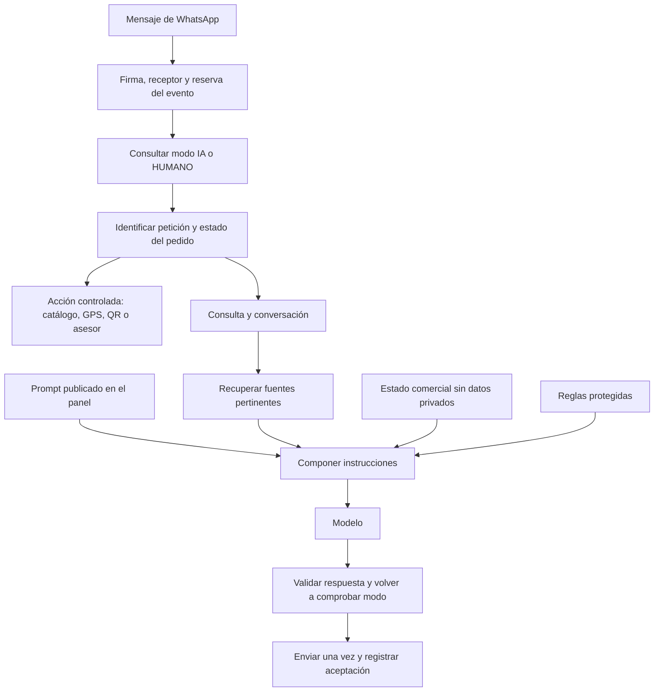

# Terra: comportamiento editable y pruebas locales

Fecha: 12 de septiembre de 2026. Estado: implementado y desplegado en el agente.
La preparación local se conserva como registro histórico; la verificación final
está en [Liberación del comportamiento](LIBERACION_COMPORTAMIENTO_20260912.md).

## Respaldo y referencia operativa

- Servicio: `agentevps / agente`. El catálogo público es otro servicio.
- Base de trabajo: `7640012d5cbb3e6938dbd53e17920fb8fa16f4bc`, posterior a la
  corrección histórica `bc55062`. No se trabajó sobre el worktree de producción antiguo.
- Respaldo solicitado **angenteterra 1**: `E:\Terra App\backups\angenteterra 1`.
- Referencia recuperable: `codex/safety-angenteterra-1`.
- Archivo: `angenteterra-1.bundle`, autocontenido, verificado con `git bundle verify`.
- SHA256: `C155FB76157EBEFC5B53EBCF08B68597D5A2BAE87EC81227959AEC0DBFBFB849`.
- Rama de implementación: `codex/agent-behavior-panel-20260912`.
- Commit funcional: `b252665` (panel, integración del prompt y comportamiento).
- Worktree aislado: `E:\Terra App\01\.agent-worktrees\angenteterra-1`.
- Se consultó la tarea **_Parche Baneo**, id
  `01a09293-b64d-7af1-bfb5-dd2dcf8abf47`, además de la guía mínima y los apartados
  pertinentes del contrato de estabilidad. No se copiaron conversaciones privadas.

Ese historial distingue una pérdida de respuestas por suscripción `messages` de
la causa del baneo, que no se demostró. Las pruebas conservan las protecciones
técnicas; no certifican inmunidad frente a restricciones de Meta.

El respaldo contiene fuentes e historial Git. No contiene la base operativa,
secretos, archivos privados ni una copia del estado de producción.

## Qué cambió

En `/comportamiento` se puede leer el prompt activo, editar un borrador, publicar,
consultar versiones y restaurar una versión previa. Guardar no activa el borrador.
Restaurar crea una versión nueva y conserva cualquier borrador guardado. El panel
muestra las 19 publicaciones más recientes y las instrucciones iniciales; las
versiones anteriores permanecen almacenadas.

Cada consulta al modelo lee la versión activa al comenzar. Una publicación afecta
la siguiente consulta; una respuesta que ya empezó usa la versión que capturó.
Un error de lectura de configuración falla de forma explícita, sin cambiar
silenciosamente a otro prompt. La API usa la autenticación existente, validación
de origen, límites de tamaño y revisión optimista para evitar sobrescribir ediciones.

Las instrucciones iniciales dejaron de asumir que toda consulta significa una
compra decidida. El código también cambió: una duda u objeción puede responderse
sin volver a exigir GPS, pago o comprobante. Un agradecimiento tiene un cierre
breve. Una consulta inicial concreta puede llegar al modelo sin forzar catálogo.

El código distingue «asesor», «no quiero asesor» y «¿eres humano?». Una negación
de confirmación no vincula el pedido. Cambiar o cancelar no se presenta como una
operación realizada. Explorar de nuevo el catálogo conserva el pedido activo.

Se conserva literalmente: **Si prefieres atención humana, escribe "asesor".**
También se incluye en la confirmación de un pedido que llega desde la web.

El panel del chat etiqueta las respuestas del servicio como **Automático**, porque
algunas son respuestas del flujo y otras del modelo. La ausencia de confirmación
local de envío se muestra como **Envío sin confirmar**, sin afirmar que Meta no lo
recibió ni invitar a repetirlo.

El lector de catálogo ya no convierte precios vacíos, nulos o inválidos en Bs 0.
Un cero explícitamente publicado sigue siendo válido; una variante sin precio
conserva esa ausencia y no se cotiza usando un importe de otro producto.

## Cómo se conectan las piezas



| Elemento | Responsabilidad | Dónde se administra |
| --- | --- | --- |
| Prompt | Identidad, tono, prioridades y forma de conversar | Nuevo panel Comportamiento |
| Conocimiento | Información comercial aprobada | Panel Base de conocimiento |
| Catálogo | Producto, variante, precio y disponibilidad publicados | Servicio del catálogo |
| Memoria | Mensajes recientes y selección; contexto reducido antes del modelo | Sistema del agente |
| Pedido | Confirmación, GPS, QR y revisión de comprobante | Flujo validado del agente |
| Protecciones | Firma, canal, duplicados, modo HUMANO y límites de acciones | Código, fuera del editor |

Hay dos situaciones comerciales principales: **orientación** y **compra con pedido
confirmado**. El modo IA/HUMANO es independiente. La compra conserva sus estados:
pendiente de confirmación por chat, ubicación, pago y comprobante en revisión.
Una persona que llega directamente desde la web usa el mensaje de confirmación
del catálogo; quien ya venía de WhatsApp conserva la asociación privada existente.
No se cambió el contrato de servidor entre catálogo y agente.

El RAG consulta el índice disponible y recupera fuentes; si está habilitada la
búsqueda semántica intenta esa vía, con recuperación de texto como alternativa.
El catálogo publicado aporta sus datos vigentes. Un fallo temporal del índice ya
no lo desactiva hasta reiniciar: se vuelve a intentar después de 30 segundos.
Un Markdown local marcado **borrador** no aporta su contenido como conocimiento
publicado; se usa el respaldo básico existente. No se publicaron documentos reales.

Preguntas generales sobre garantías o métodos de pago pueden llegar al modelo
cuando hay evidencia pertinente. Un título como «Política» no es suficiente.
La aprobación de un pago y las operaciones sobre un pedido siguen fuera del modelo.
La minimización del historial reduce números privados, enlaces, códigos, correos,
coordenadas y expresiones habituales de domicilio. Es un filtro conservador,
no una garantía de reconocer todos los datos personales escritos en lenguaje libre.

## Pruebas y revisión local

Desde el worktree aislado, sin archivos `.env` ni carpeta `data`:

```powershell
npm run test:local
node node_modules/typescript/bin/tsc --noEmit --incremental false
npm run lint
npm run build:local
node --test scripts/behavior-preview-guard.test.mjs
npm run preview:behavior
```

El launcher del preview usa `http://127.0.0.1:3187/comportamiento`, credenciales
**ficticias** `terra-preview` / `local-preview-only` y una SQLite nueva bajo el
directorio temporal del sistema. Imprime la carpeta concreta al iniciar. No abre
`messages.db`. Bloquea rutas operativas y conexiones externas desde el proceso.
El filtro de red es una defensa de desarrollo, no una caja de aislamiento del SO.
`-- --check` solo revisa las condiciones; `-- --start` sirve un build ya creado.

La pantalla de prueba ejecuta el mismo procesador, recuperador puro y compositor
de instrucciones con base en memoria, documentos ficticios y proveedores
simulados. Muestra el camino elegido, las fuentes y las instrucciones entregadas.
Cada ejecución es un turno independiente. Si no llamó al generador, lo indica.
No usa Meta, el modelo real, Supabase ni documentos operativos; por ello no sirve
para valorar todavía la naturalidad de una respuesta del modelo real.

Las verificaciones cubren origen/receptor incorrectos, repetición del mismo evento,
aceptación seguida de fallo local, transporte incierto, cambio a HUMANO durante
esperas, reservas antiguas, asociaciones de pedido y ausencia de datos en logs.
También cubren publicación/restauración/conflictos, sanitización, RAG y los nuevos
casos conversacionales. Resultado: **245 pruebas aprobadas en 22 archivos**, más
la prueba autónoma de aislamiento del preview. TypeScript y build local aprobados.
Lint sin errores, con una advertencia previa en el export del worker Deno.

Verificación HTTP con Next real aprobada: pantalla accesible, autenticación,
guardar sin activar, publicación, conflicto 409, restauración conservando borrador,
simulación y fuentes. Se corrigió la validación del origen cuando Next normaliza
`127.0.0.1` a `localhost`. La revisión posterior con navegador conectado confirmó
el editor, los controles y una consulta del simulador con su fuente ficticia.
El navegador integrado dejaba la navegación sin contenido al no mostrar el
desafío HTTP Basic. Se autenticó la sesión de prueba y después se abrió la URL
limpia, sin credenciales: los fetch relativos no aceptan una URL base con usuario
y contraseña. No fue necesario desactivar la autenticación ni cambiar producción.

ESLint permite `@ts-nocheck` con explicación solamente en los dos workers Deno
existentes. La compilación de Next no valida el runtime de Supabase; estos workers
no se desplegaron ni se cambió su implementación en este trabajo.

## Reversión y siguiente fase

Para recuperar el código original sin sobrescribir ningún trabajo, clonar el
bundle en una **carpeta nueva** y elegir `codex/safety-angenteterra-1`:

```powershell
git clone --branch codex/safety-angenteterra-1 "E:\Terra App\backups\angenteterra 1\angenteterra-1.bundle" "E:\Terra App\recuperacion-angenteterra-1"
```

En el panel se puede revertir solo el comportamiento publicando una versión
anterior. Esa configuración vive en `data/agent-behavior.db` o en la ruta
`TERRA_BEHAVIOR_DB_PATH`; debe incluirse en el respaldo operativo cuando se prepare
un despliegue. Revertir código no implica restaurar ni borrar pedidos nuevos.

El resultado anterior corresponde a la primera verificación local. La evaluación
posterior con el modelo real, los controles ampliados, el conocimiento publicado,
los respaldos y el estado del despliegue se registran en
[Liberación del comportamiento](LIBERACION_COMPORTAMIENTO_20260912.md).
Antes de cualquier contacto de prueba por WhatsApp, verificar servicio, cuenta,
callback y suscripción `messages`, además del destinatario de prueba autorizado.

El usuario necesita valorar el tono y confirmar las políticas comerciales que
faltan. Las pruebas técnicas locales y la preparación se pueden realizar sin
contactar clientes. No se promete que la palabra «asesor» por sí sola evite baneos.

Quedan fuera de esta primera implementación una cola durable por chat, recuperación
de entregas inciertas, clasificación real de adjuntos y una operación completa de
posventa. No se afirma que el simulador de texto cubra esas capacidades.

Referencia de composición: [OpenAI Docs — Responses API](https://developers.openai.com/api/reference/typescript/resources/responses/methods/create).
La llamada conserva el proveedor, modelo configurado y `store: false` existentes;
el cambio consiste en cargar las instrucciones publicadas para cada consulta.
